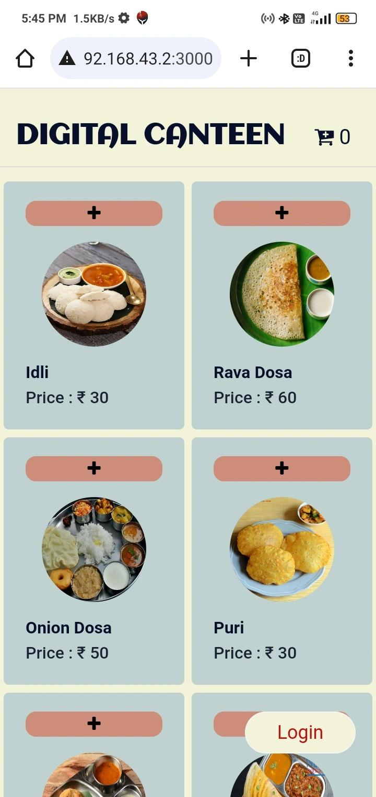
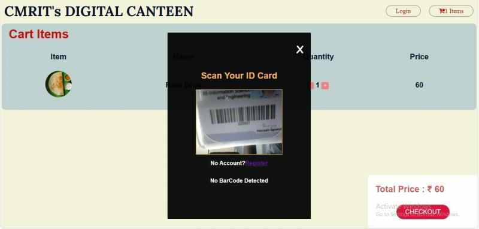
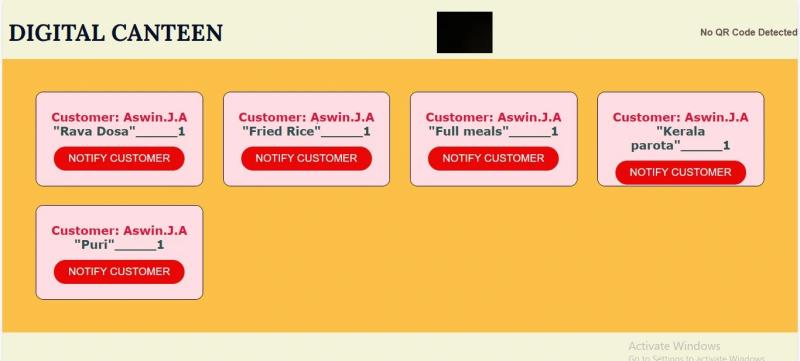

# 🍽️ Crowd Management System for Canteen

A web-based platform built to streamline food ordering and reduce overcrowding in campus canteens. Students can pre-order food, receive pickup notifications, and avoid long queues, especially during peak hours. The system enhances efficiency for both users and canteen staff.

---
Setup Instructions

1. Clone the Repository
```bash
git clone https://github.com/your-username/digital-canteen.git
```
3. Navigate into Project Folder
cd digital-canteen

4. Install Dependencies
npm install

5. Set Environment Variables
Create a file named .env in the project root and add:

PORT=5000
MONGO_URI=your_mongodb_connection_string

# Nodemailer setup
EMAIL=your_email@gmail.com
PASS=your_app_password_here   # <-- Add passkey here


Note: Use an App Password if you’re using Gmail (not your regular password).

5. Run the Server
node server

6. Open in Browser
http://localhost:5000
---

## 🔒 Key Features

- 🧾 **Online Food Ordering**: Allows students to place food orders via a simple web interface.  
- ⏱️ **Real-time Notifications**: Users are notified when their food is ready, minimizing physical crowding.  
- 👨‍🍳 **Admin Order Panel**: Canteen staff can efficiently view and manage incoming orders.  
- 📉 **Wait Time Reduction**: Reduced average wait time from 15 minutes to 3–4 minutes.  
- 🔐 **Simple Auth System**: Login and order tracking implemented for better user flow.

---

## 🛠️ Tech Stack

- **Frontend**: HTML, CSS, JavaScript  
- **Backend**: Node.js, Express.js  
- **Database**: MongoDB

---

## 📸 Images

### 🧾 User Interface  


### 🪪 Login Using Student ID  


### 🧑‍🍳 Admin Order Management  


---
